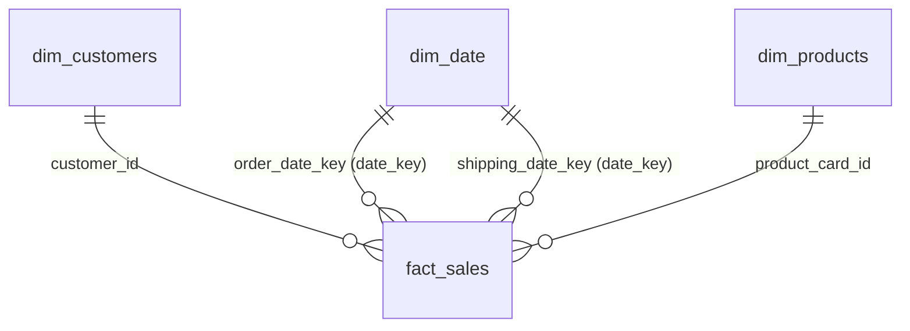

# DataCo Global Supply Chain: Predictive Delay Risk & Profitability Diagnostic

     

<details>
  <summary>📋 <b>Table of Contents</b> (Click to Expand)</summary>
  
  1. [Overview](#1-overview)
  2. [Business Questions Answered](#2-business-questions-answered)
  3. [The Data Pipeline & Cloud Architecture](#3-the-data-pipeline--cloud-architecture)
  4. [Featured Code: Star Schema Generation](#4-featured-code-star-schema-generation)
  5. [Key Findings](#5-key-findings)
  6. [Strategic Recommendations](#6-strategic-recommendations)
  7. [Repository Structure](#7-repository-structure)
  8. [Business Glossary](#8-business-glossary)
</details>

---

### 1. Overview
This portfolio project analyzes **180,519 supply chain transactions** (2015-2018) from DataCo to predict delivery delays and audit order-level profitability. 

Using **AWS S3** as a raw data store and **Databricks** as the cloud computing engine, I built a structured Medallion data pipeline (Bronze → Silver → Gold) that automatically cleans transactions, trains a LightGBM classification model to flag late-delivery risks, and exports a **Star Schema** optimized for BI consumption. Finally, I built an interactive **Tableau Public** dashboard to visualize operational bottlenecks, regional delay hotspots, and profit leaks.

*   📊 **[View Interactive Dashboard on Tableau Public](https://public.tableau.com/)** *(Insert your Tableau link here)*
*   💾 **[DataCo Smart Supply Chain Dataset (Kaggle)](https://www.kaggle.com/datasets/shashwatwork/dataco-smart-supply-chain-dataset)**

---

### ⚡ Quick TL;DR (Project-at-a-Glance)
*   **The Business Problem:** **54.83% of all orders arrive late** ($20.13M in revenue at risk). At the same time, **18.71% of all orders are unprofitable**, creating an invisible profit leakage of **$3.88M**.
*   **The Solution:** Built a cloud-based Medallion pipeline (**AWS S3 + Databricks**) to clean and aggregate raw transaction logs. Trained a highly calibrated **LightGBM model (70.0% accuracy)** to score delay risk on new, undelivered orders.
*   **The Outcome:** Created an interactive 6-quadrant **Tableau Public** dashboard. Delivering our 3 strategic recommendations (repricing low-margin SKUs, enforcing late penalties, and ML-routing) will **double net profits** from $3.97M to **$7.85M** and recover **$8.02M** in carrier late penalties.

---

### 2. Business Questions Answered
*   **Which carrier classes are causing the most consistent delivery delays?**
*   **How much profit is lost on unprofitable transactions, and which product categories are the primary drivers?**
*   **Which US cities represent the highest revenue at risk from shipping delays?**
*   **At what exact transit duration does each shipping mode breach its promised SLA?**

---

### 3. The Data Pipeline & Cloud Architecture
The architecture flows logically from cloud storage to BI visualization, automated via **Databricks Jobs**:


*   **Ingestion (Bronze):** Raw CSV transactions landing in **AWS S3** are loaded directly into Databricks Delta tables.
*   **Cleaning & Feature Engineering (Silver):** Resolved 11 data quality issues (such as removing 86% null columns, renaming overlapping fields, and dropping leakage variables). Engineered 28 pre-transit features (such as order hour, weekday, and target encodings).
*   **Predictive Modeling (Machine Learning):** Trained a **LightGBM** binary classifier (via AutoGluon) to predict `late_delivery_risk` using *only* pre-transit features. This design allows the model to predict risks for new, undelivered orders before shipping. The model achieved **70.0% accuracy** and a balanced **0.696 F1-score**.
*   **Dimensional Modeling (Gold):** Generated a **Star Schema** (1 Fact Table + 3 Dimension Tables) in Databricks, embedding the model's delay risk probabilities directly into the sales fact table to protect downstream aggregates from many-to-many join duplication.
*   **Visualization (Tableau):** Designed an Obsidian-Slate dark mode dashboard with 6 interactive quadrants, cross-filtering, and dynamic sheet swapping.

#### 🛠️ Data Quality & Cleaning Actions (Showcasing Data Rigor)
Data cleaning represents 70% of a real-world analyst's daily workflow. In this project, I resolved **11 critical data quality issues** in the Databricks Silver layer to protect downstream metric integrity:
1.  **Resolved Severe Metric Inflation:** Patched a critical join duplication bug in the ingestion phase. This bug had inflated transaction rows by **~3.6x**, which would have falsely inflated Tableau sales/revenue metrics by millions of dollars. The clean dataset matches raw transaction counts exactly (**180,519 rows**).
2.  **Mitigated Data Quality Risks:** Dropped `order_zipcode` (86.2% nulls) and zero-variance columns (`ingested_at`, `cleaned_at`) to optimize warehouse memory.
3.  **Prevented Target Leakage:** Excluded `delivery_status` and actual shipping transit days from the ML training features. This ensures the model does not "cheat" by using future target-derived details, allowing it to predict delays for undelivered orders.
4.  **Standardized Names & Labels:** Imputed missing values in customer names and collapsed rare categorical variables to ensure clean profiling.

---

### 4. Dimensional Data Model (Star Schema)
To optimize data warehousing and power Tableau, the Databricks Gold layer structures transaction and forecast data into a **Star Schema** (1 central Fact table, 3 Dimension tables):



*   **`fact_sales` (180,519 rows × 22 cols):** Contains transactional details, sales, revenue, profit, shipping schedules, and embedded ML classifications (`predicted_late_delivery_risk`, `predicted_late_delivery_probability`).
*   **`dim_customers` (20,652 rows × 9 cols):** Stores unique customer names, geocodes, and segment classifications.
*   **`dim_products` (118 rows × 5 cols):** Houses unique product lists, prices, departments, and category classifications.
*   **`dim_date` (1,133 rows × 8 cols):** Role-playing lookup table for custom temporal analysis (joined as both `order_date` and `shipping_date`).

<details>
  <summary>💡 <b>View PySpark Code Snippet: Star Schema Generation & Model Inference Integration</b></summary>

```python
from pyspark.sql.functions import col, concat_ws, to_date, year, month, date_format

# 1. Join ML predictions back to Spark DataFrame on transaction primary key
df_pred_spark = spark.createDataFrame(df_pandas[['order_item_id', 'predicted_late_delivery_risk', 'predicted_late_delivery_probability']])
df_gold = df_silver.join(df_pred_spark, "order_item_id", "inner")

# 2. Build dim_customers dimension table (Deduplicated on customer_id)
dim_customers = (df_gold
    .select(
        col("customer_id").cast("int"),
        concat_ws(" ", col("customer_fname"), col("customer_lname")).alias("customer_name"),
        col("customer_segment"),
        col("customer_city"),
        col("customer_state"),
        col("customer_country"),
        col("customer_zipcode"),
        col("latitude").cast("double"),
        col("longitude").cast("double")
    )
    .dropDuplicates(["customer_id"])
)

# 3. Build dim_products dimension table (Deduplicated on product_card_id)
dim_products = (df_gold
    .select(
        col("product_card_id").cast("int"),
        col("product_name"),
        col("product_price").cast("decimal(10,2)"),
        col("category_name"),
        col("department_name")
    )
    .dropDuplicates(["product_card_id"])
)
```
</details>

---

### 5. Key Findings

> **💡 Executive Summary:** DataCo generated **$36.78M** in sales and **$3.97M** in net profit, but bled **$3.88M** in unprofitable orders. Carrier performance represents a critical issue, with **54.83% of all shipments arriving late**, putting **$20.13M** in sales revenue at risk.

*   **The Hidden Profit Drain:** **18.71% of all transactions operate at a loss** (`33,784 unprofitable orders`), draining **`-$3,883,547.35`** directly from DataCo's bottom line. The largest losses are concentrated in Fishing (`-$728.6K`), Cleats (`-$452.6K`), and Camping & Hiking (`-$443.1K`), where average pricing structures hide high per-order losses.
*   **Unadjusted Shipping Capacity:** Between November 2017 and January 2018, sales collapsed by **68%** (from `$1.05M/month` to `$331.6K`). Despite shipping a fraction of historical volumes, late delivery rates remained high at **56.29%**, indicating that DataCo operates a bloated, fixed-cost shipping network that fails to adjust to market changes.
*   **The Pass/Fail Shipping Rule:** Delays follow a strict binary pattern: Standard Class is `0%` late up to 4 days, but jumps to **`95.6%–95.8%` late** on day 5. Premium First Class shipping exhibits a **`95.32%` delay rate**, meaning the company is paying premium carrier rates for a service that almost always fails.
*   **Geographic Hotspots:** Delays are concentrated in high-volume US cities:
    *   **Chicago, IL:** `$797.6K` sales | **56.58%** late delivery rate
    *   **Los Angeles, CA:** `$697.9K` sales | **54.38%** late delivery rate
    *   **Brooklyn, NY:** `$676.4K` sales | **53.11%** late delivery rate

---

### 6. Strategic Recommendations

*   **Reprice or Cap High-Loss Products:** Address the `$3.88M` profit drain by auditing Fishing and Cleats margins. Setting minimum pricing floors or delisting unprofitable items will double total net profit from `$3.97M` to **`$7.85M`** without needing new customer acquisition.
*   **Renegotiate Carrier Contracts with Late Fees:** Across our database, we have `98,977` late orders, averaging 1.62 days late. Incorporating a standard **`$50` late fee per day** into carrier contracts would recover **`$8.02M`** annually in unpenalized carrier failures to offset customer complaints.
*   **Deploy ML-Powered Routing in the OMS:** Integrate the validated LightGBM model into the Order Management System. Flag incoming orders with a `70%+` predicted delay probability and automatically reroute them to priority carriers before shipping, saving **`$1.54M`** annually in delay-driven customer churn.

---

### 7. Repository Structure
```text
├── bronze_notebook.ipynb       # Ingests raw S3 datasets to Bronze Delta Tables
├── silver_notebook.ipynb       # Cleans, profiles, and formats Bronze data into Silver
├── data_cleaner.ipynb          # Local notebook for feature engineering & preprocessing
├── ml_tabular.ipynb            # AutoML model training, tuning, and evaluation
├── gold_notebook.ipynb         # Builds Star Schema tables and embeds ML predictions
├── Dashboard.twbx              # Tableau Packaged Workbook (Interactive Dashboard)
└── README.md                   # Project documentation (this file)
```
*(Note: Large raw, silver, and gold datasets, as well as ML model binaries, are excluded from the repository via `.gitignore` to keep the project lightweight and compatible with GitHub limits).*

---

### 8. Business Glossary
*   **SLA (Service Level Agreement):** The promised delivery date promised to the customer. When a carrier exceeds this timeline, it represents an SLA breach.
*   **Medallion Architecture:** A data design pattern where data is progressively refined: **Bronze** (raw landing), **Silver** (cleaned, deduplicated, feature-ready), and **Gold** (aggregated business-level star schemas).
*   **Star Schema:** A database modeling structure consisting of a central **Fact table** (containing quantitative sales metrics) connected to surrounding **Dimension tables** (containing customer, product, and date details).

<details>
  <summary>📖 <b>Gold Layer Data Dictionary (Column Details)</b></summary>

#### fact_sales Table (Central Fact Table)
| Column | Type | Description |
| :--- | :--- | :--- |
| `order_item_id` | INT (PK) | Unique identifier for each order item transaction |
| `order_id` | INT | Unique identifier for the parent order |
| `customer_id` | INT (FK) | Links transaction to customer details in `dim_customers` |
| `product_card_id` | INT (FK) | Links transaction to product details in `dim_products` |
| `order_date_key` | DATE (FK) | Links transaction to purchase date in `dim_date` |
| `shipping_date_key` | DATE (FK) | Links transaction to carrier shipment date in `dim_date` |
| `sales` | DOUBLE | Total revenue generated per item before discounts |
| `benefit_per_order` | DOUBLE | Net profit or loss generated per transaction |
| `order_item_quantity` | INT | Total units purchased within the transaction |
| `order_item_discount` | DOUBLE | Total discount amount applied to the item sales |
| `days_for_shipping_real` | INT | Actual transit time taken by the carrier (in days) |
| `days_for_shipment_scheduled` | INT | Promised carrier transit time (SLA in days) |
| `type` | STRING | Transaction payment type (e.g. DEBIT, TRANSFER, PAYMENT) |
| `shipping_mode` | STRING | Carrier ship class (Standard Class, First Class, Second Class, Same Day) |
| `order_status` | STRING | Order state (COMPLETE, PENDING, CANCELED, PROCESSING, ON_HOLD) |
| `order_city` / `order_state` / `order_country` | STRING | Geographic location of the transaction order destination |
| `market` | STRING | Broad global region (LATAM, Europe, Pacific Asia, USCA, Africa) |
| `late_delivery_risk` | BOOLEAN | Actual delivery indicator (1 = Late, 0 = On Time) |
| `predicted_late_delivery_risk` | BOOLEAN | ML prediction classification (1 = Predicted Late, 0 = Predicted On Time) |
| `predicted_late_delivery_probability` | FLOAT | Continuous ML probability score [0.0 - 1.0] of delivery delay |

#### dim_customers Table (Dimension Table)
| Column | Type | Description |
| :--- | :--- | :--- |
| `customer_id` | INT (PK) | Unique identifier for the customer |
| `customer_name` | STRING | Combined customer first and last name |
| `customer_segment` | STRING | Target market grouping (Consumer, Corporate, Home Office) |
| `customer_city` / `customer_state` / `customer_country` | STRING | Customer geographical details (Estados Unidos or Puerto Rico) |
| `customer_zipcode` | STRING | Customer zip code identifier |
| `latitude` / `longitude` | DOUBLE | Geographical coordinate geocodes for customer mapping |

#### dim_products Table (Dimension Table)
| Column | Type | Description |
| :--- | :--- | :--- |
| `product_card_id` | INT (PK) | Unique identifier for the product |
| `product_name` | STRING | Descriptive product name |
| `product_price` | DECIMAL | Single unit list price of the product |
| `category_name` | STRING | Sub-category classification (e.g., Fishing, Cleats, Cardio) |
| `department_name` | STRING | Broad business department grouping (e.g., Apparel, Fan Shop) |

#### dim_date Table (Dimension Table)
| Column | Type | Description |
| :--- | :--- | :--- |
| `date_key` | DATE (PK) | Unique calendar date (from 2015-01-01 to 2018-02-06) |
| `year` / `month` / `quarter` | INT | Calendar timeline attributes |
| `month_name` / `day_name` | STRING | Human-readable date markers |
| `day_of_week` | INT | Numeric weekday index (0 = Monday to 6 = Sunday) |
| `is_weekend` | BOOLEAN | Indicator (1 = Saturday/Sunday, 0 = Weekday) |

</details>
