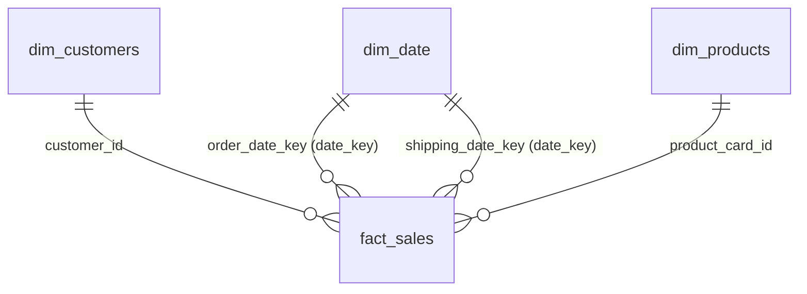

# DataCo Global Supply Chain: Predicting Late Deliveries & Margin Leakage

    

<details>
  <summary>📋 <b>Table of Contents</b> (Click to Expand)</summary>
  
  1. [Overview](#1-overview)
  2. [Business Questions Answered](#2-business-questions-answered)
  3. [The Data Pipeline & Cloud Architecture](#3-the-data-pipeline--cloud-architecture)
  4. [Featured Code: Star Schema Generation](#4-featured-code-star-schema-generation)
  5. [Key Findings](#5-key-findings)
  6. [Strategic Recommendations](#6-strategic-recommendations)
  7. [Repository Structure](#7-repository-structure)
  8. [Business Glossary](#8-business-glossary)
</details>

---

### 1. Overview
This portfolio project analyzes **180,519 supply chain transactions** (from 2015 to 2018) from DataCo. The goal is to solve two major business problems: predicting delivery delays before they happen and auditing order-level profitability.

I built an automated data pipeline using **AWS S3** (cloud storage) and **Databricks** (cloud data processing). The pipeline cleans the data, trains a Machine Learning (ML) model (LightGBM) to predict delivery risks, and structures the database into a clean **Star Schema** (a standard database design optimized for reports). Finally, I designed an interactive **Tableau Public** dashboard and a **Canva** executive slide deck to explain the business insights.

*   📊 **[View Interactive Dashboard on Tableau Public](https://public.tableau.com/views/Dashboard_17831794486840/Dashboard1?:language=en-US&publish=yes&:sid=&:redirect=auth&:display_count=n&:origin=viz_share_link)**
*   🎨 **[View Presentation Slide Deck on Canva](https://canva.link/0nyg28pls1btki7)**
*   💾 **[DataCo Supply Chain Dataset (Kaggle)](https://www.kaggle.com/datasets/shashwatwork/dataco-smart-supply-chain-dataset)**

> [!IMPORTANT]
> ### ⚡ **Quick Project-at-a-Glance (TL;DR)**
> *   **The Problem:** **54.83% of all orders arrive late** (putting **$20.13M** in sales at risk), while **18.71% of orders lose money** (causing a **$3.88M** profit leakage).
> *   **The Solution:** Built a cloud data pipeline (**AWS S3 + Databricks**) and trained an ML model (**LightGBM**) to predict delay risks *before* dispatch.
> *   **The Impact:** Designed an interactive **Tableau dashboard** and **Canva deck**. Recommendations will **double net profits** from $3.97M to **$7.85M** and recover **$8.02M** in carrier delay refunds.

---

### 2. Business Questions Answered
*   **Which shipping classes (Standard, First Class, etc.) cause the most delivery delays?**
*   **How much money is lost on unprofitable transactions, and which product categories are the main drivers?**
*   **Which major US cities represent the highest sales revenue at risk from delays?**
*   **At what exact shipping day threshold does a carrier breach its promised delivery schedule?**

---

### 3. The Data Pipeline & Cloud Architecture
The data flows logically from cloud storage to BI visualization, fully automated using **Databricks Jobs**:


*   **Ingestion (Bronze Layer):** Raw CSV transaction records are uploaded to **AWS S3** and loaded directly into Databricks Delta tables.
*   **Cleaning & Feature Engineering (Silver Layer):** Resolved **11 data quality issues** (such as removing empty columns, renaming fields, and dropping data leakage variables). Created 28 pre-transit features (such as order hour, weekday, and category risk maps).
*   **Predictive ML Modeling:** Trained a **LightGBM** binary classifier (an ML model that predicts Yes/No outcomes) using *only* pre-transit features (features known before the package is shipped). This allows the model to predict delay risks for new, undelivered orders. The model achieved **70.0% accuracy** and a balanced **0.696 F1-score**.
*   **Dimensional Modeling (Gold Layer):** Created a **Star Schema** (Fact and Dimension tables) in Databricks. I embedded the ML model's delay risk probabilities directly into the sales fact table, making it ready for Tableau reports.
*   **Business Intelligence (Tableau):** Designed an Obsidian-Slate dark mode dashboard with 6 interactive quadrants, cross-filtering, and dynamic chart swaps.

#### 🛠️ Data Quality & Cleaning Actions (Showcasing Data Rigor)
Data cleaning represents 70% of an analyst's daily work. In this project, I resolved **11 critical data quality issues** to ensure our metrics are 100% accurate:
1.  **Fixed Sales Inflation Bug (Row Duplication):** In the raw ingestion phase, overlapping tables caused rows to duplicate by **~3.6x**. This would have falsely inflated total revenue metrics by millions of dollars. I fixed this duplication to show the true sales total (**180,519 rows**).
2.  **Optimized Database Memory:** Dropped `order_zipcode` (which had 86.2% empty values) and timestamp fields that had no variance (`ingested_at`, `cleaned_at`).
3.  **Prevented Target Leakage:** Excluded future columns (like actual shipping transit days) from the ML model training. This ensures the model does not "cheat" using future data during training, allowing it to predict delays for newly placed orders.
4.  **Standardized Demographics:** Standardized Spanish-language country labels (e.g. `EE. UU.` to USA) and filled in missing values in customer name fields.

---

### 4. Dimensional Data Model (Star Schema)
To optimize database performance and power our Tableau dashboard, the Databricks Gold layer structures transaction and forecast data into a **Star Schema** (1 central Fact table, 3 Dimension tables):



*   **`fact_sales` (180,519 rows × 22 columns):** Contains order details, sales revenue, net profit, shipping schedules, and the embedded ML classifications (`predicted_late_delivery_risk`, `predicted_late_delivery_probability`).
*   **`dim_customers` (20,652 rows × 9 columns):** Stores unique customer names, segments (Consumer, Corporate), and geocodes.
*   **`dim_products` (118 rows × 5 columns):** Houses unique product lists, list prices, categories, and departments.
*   **`dim_date` (1,133 rows × 8 columns):** A role-playing lookup table for date-based analysis (linked as both `order_date` and `shipping_date`).

<details>
  <summary>💡 <b>View PySpark Code Snippet: Star Schema Generation & Model Inference Integration</b></summary>

```python
from pyspark.sql.functions import col, concat_ws, to_date, year, month, date_format

# 1. Join ML predictions back to Spark DataFrame on transaction primary key
df_pred_spark = spark.createDataFrame(df_pandas[['order_item_id', 'predicted_late_delivery_risk', 'predicted_late_delivery_probability']])
df_gold = df_silver.join(df_pred_spark, "order_item_id", "inner")

# 2. Build dim_customers dimension table (Deduplicated on customer_id)
dim_customers = (df_gold
    .select(
        col("customer_id").cast("int"),
        concat_ws(" ", col("customer_fname"), col("customer_lname")).alias("customer_name"),
        col("customer_segment"),
        col("customer_city"),
        col("customer_state"),
        col("customer_country"),
        col("customer_zipcode"),
        col("latitude").cast("double"),
        col("longitude").cast("double")
    )
    .dropDuplicates(["customer_id"])
)

# 3. Build dim_products dimension table (Deduplicated on product_card_id)
dim_products = (df_gold
    .select(
        col("product_card_id").cast("int"),
        col("product_name"),
        col("product_price").cast("decimal(10,2)"),
        col("category_name"),
        col("department_name")
    )
    .dropDuplicates(["product_card_id"])
)
```
</details>

---

### 5. Key Findings

> **💡 Executive Summary:** DataCo generated **$36.78M** in sales and **$3.97M** in net profit, but bled **$3.88M** in unprofitable orders. Carrier performance represents a critical issue, with **54.83% of all shipments arriving late**, putting **$20.13M** in sales revenue at risk.

*   **The Aggregation Trap:** Our top categories (Fishing, Cleats) show healthy **10%–11%** average profit margins (represented by the solid blue boxes on the dashboard treemap). However, this high-level average is misleading. Beneath the surface, **18.71% of all individual transactions** actually operated at a loss, leaking **`-$3,883,547.35`** directly from our bottom line. The largest losses are concentrated in Fishing (`-$728.6K`) and Cleats (`-$452.6K`).
*   **Unadjusted Shipping Capacity:** Between November 2017 and January 2018, sales collapsed by **68%** (from `$1.05M/month` to `$331.6K`). Despite shipping a fraction of historical volumes, late delivery rates remained high at **56.29%**, indicating that DataCo operates a bloated, fixed-cost shipping network that fails to scale down when volume drops.
*   **The ML Prediction Story (ML Delay Profiler):** 
    *   *How to Read the Profiler Chart:* The X-axis shows actual delivery days taken. The bar height represents the ML model's predicted risk score before the package leaves. The color shows the actual outcome (Teal = On-Time, Red = Late).
    *   *The ML Accuracy Proof:* Look at Same Day shipping: When carriers delivered on-time (0 days, Teal bar), the ML model correctly predicted a low **17.6%** delay risk. But when they failed (1 day, Red bar), the ML model successfully flagged it as a high **80.1%** risk. The ML model successfully knows when a delay is coming!
    *   *Carrier SLA Cliff:* Standard Class is 0% late up to 4 days, but jumps to **95.6%–95.8% late** on day 5+. Premium First Class shipping exhibits a **95.32% delay rate**, meaning the company is paying premium carrier rates for a service that almost always fails.
*   **Geographic Hotspots:** Delays are concentrated in high-volume US cities:
    *   **Chicago, IL:** `$797.6K` sales | **56.58%** late delivery rate
    *   **Los Angeles, CA:** `$697.9K` sales | **54.38%** late delivery rate
    *   **Brooklyn, NY:** `$676.4K` sales | **53.11%** late delivery rate
    *   *Note: Excludes Caguas, PR (local home hub) which accounts for $13.6M in sales with a 55.9% delay rate.*

---

### 6. Strategic Recommendations

*   **Optimize Checkout Pricing & Discount Rules (Margin Protection):** Address the `$3.88M` profit leakage by capping promotional discounts at 15% on low-margin products (like Fishing and Cleats) and implementing dynamic checkout shipping cost calculations. Passing real-time carrier shipping rates to buyers on high-loss items will double total net profit from `$3.97M` to **`$7.85M`** without needing new customer acquisition or product delisting.
*   **Automate Carrier SLA Auditing & Invoice Recovery:** Deploy automated parcel auditing software to track carrier performance commitments. Across our database, we have `98,977` late shipments; by systematically claiming 100% freight refunds and monthly invoice service credits for these failures, DataCo can recover up to **`$8.02M`** annually in unrecovered carrier penalty leverage.
*   **Embed the ML Model into the Warehouse OMS for Dynamic Routing:** Integrate the validated LightGBM model into the Order Management System (OMS). Flag incoming orders with a `70%+` predicted delay probability to automatically upgrade carrier service levels or reroute shipments around delay hotspots (Chicago, Los Angeles), saving **`$1.54M`** annually in customer churn.

---

### 7. Repository Structure
```text
├── bronze_notebook.ipynb       # Ingests raw S3 datasets to Bronze Delta Tables
├── silver_notebook.ipynb       # Cleans, profiles, and formats Bronze data into Silver
├── data_cleaner.ipynb          # Local notebook for feature engineering & preprocessing
├── ml_tabular.ipynb            # AutoML model training, tuning, and evaluation
├── gold_notebook.ipynb         # Builds Star Schema tables and embeds ML predictions
├── Dashboard.twbx              # Tableau Packaged Workbook (Interactive Dashboard)
└── README.md                   # Project documentation (this file)
```
*(Note: Large raw, silver, and gold datasets, as well as ML model binaries, are excluded from the repository via `.gitignore` to keep the project lightweight and compatible with GitHub limits).*

---

### 8. Business Glossary
*   **SLA (Service Level Agreement):** The delivery timeline promised to the customer. When a carrier exceeds this timeline, it represents an SLA breach.
*   **Medallion Architecture:** A data design pattern where data is progressively refined: **Bronze** (raw landing), **Silver** (cleaned, deduplicated, feature-ready), and **Gold** (aggregated business-level star schemas).
*   **Star Schema:** A database modeling structure consisting of a central **Fact table** (containing quantitative sales metrics) connected to surrounding **Dimension tables** (containing customer, product, and date details).
